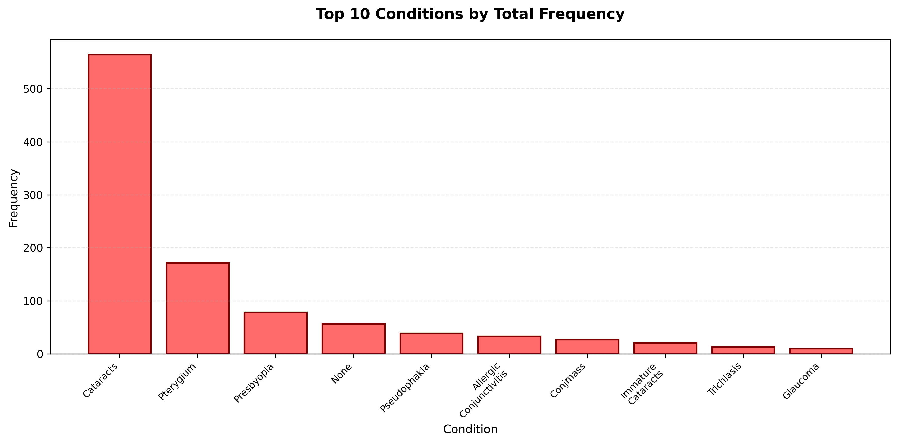
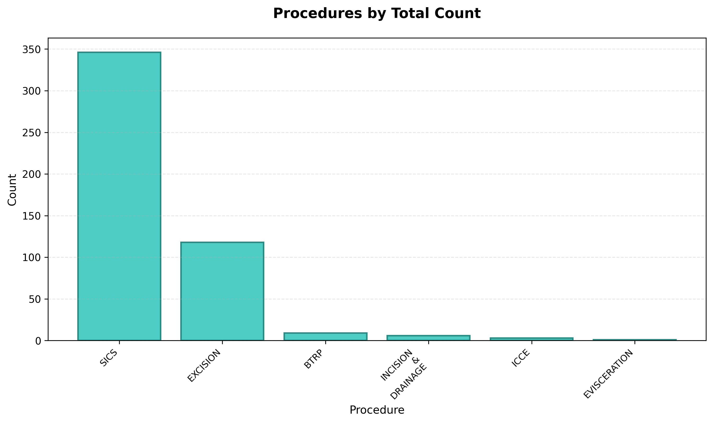
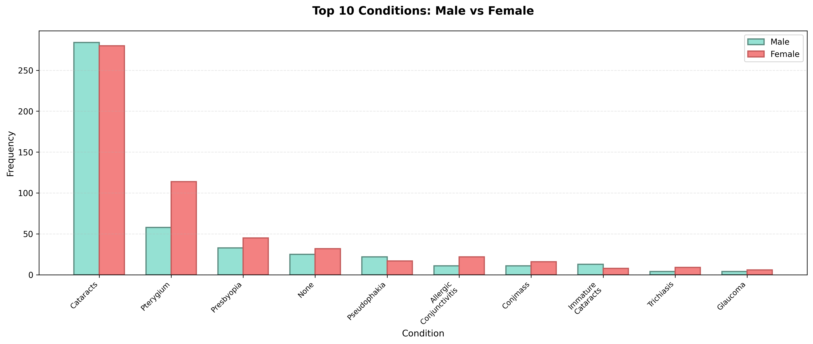
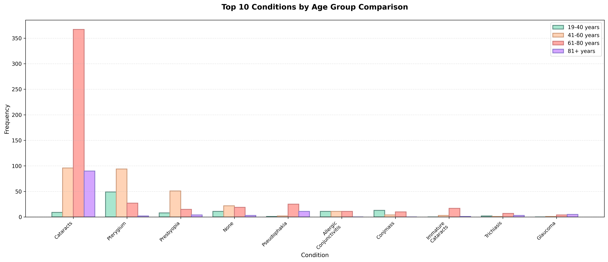

# Kilosa Eye Camp Report
## The Mo Dewji Foundation

---

## Executive Summary

The Mo Dewji Foundation conducted a comprehensive eye camp in Kilosa, providing essential eye care services to the local community. This report presents a detailed analysis of the procedures performed, conditions treated, and patient outcomes, demonstrating the significant impact of the eye camp on improving vision and quality of life for 480 patients.

The camp successfully addressed a wide range of eye conditions, with cataract surgery being the most common procedure. The analysis reveals notable improvements in visual acuity following surgical interventions, with many patients achieving optimal vision outcomes at the 1-month follow-up. The data also highlights important demographic patterns in eye health conditions across different age groups and genders.

---

## 1. Number of Procedures Done

**Total Procedures: 480**

**Gender Distribution:**
- Male: 226 (47.08%)
- Female: 254 (52.92%)

**Mean Age: 63.4 years**

The eye camp successfully performed **480 surgical procedures** on patients in Kilosa. This represents a substantial contribution to addressing the eye care needs of the community, providing critical interventions that restore vision and prevent blindness. Each procedure represents a life-changing intervention, enabling patients to regain independence, return to work, and improve their overall quality of life.

---

## 2. Frequency Distribution of Conditions

Understanding the prevalence of different eye conditions is crucial for planning future eye camps and allocating resources effectively. The following analysis provides insights into the most common eye health issues affecting the Kilosa community.

### 2.1 General Frequency Distribution

**Note:** Condition counts are higher than the number of procedures because:
- Each patient has two eyes (right and left), and conditions are counted separately for each eye
- Some individuals had more than one diagnosis in the same eye (e.g., "Cataracts; Pterygium"), and each condition is counted separately
- Therefore, the frequency represents the total number of condition occurrences across all eyes, not the number of unique patients

| Condition | Right Eye | Left Eye | Total |
|----------|-----------|----------|-------|
| Cataracts | 287 (54.05%) | 277 (51.58%) | 564 (52.81%) |
| Pterygium | 81 (15.25%) | 91 (16.95%) | 172 (16.10%) |
| Presbyopia | 41 (7.72%) | 37 (6.89%) | 78 (7.30%) |
| None | 27 (5.08%) | 30 (5.59%) | 57 (5.34%) |
| Pseudophakia | 15 (2.82%) | 24 (4.47%) | 39 (3.65%) |
| Allergic Conjunctivitis | 16 (3.01%) | 17 (3.17%) | 33 (3.09%) |
| Conjmass | 16 (3.01%) | 11 (2.05%) | 27 (2.53%) |
| Immature Cataracts | 13 (2.45%) | 8 (1.49%) | 21 (1.97%) |
| Trichiasis | 6 (1.13%) | 7 (1.30%) | 13 (1.22%) |
| Glaucoma | 5 (0.94%) | 5 (0.93%) | 10 (0.94%) |
| Blindness | 3 (0.56%) | 4 (0.74%) | 7 (0.66%) |
| Chalazion | 2 (0.38%) | 4 (0.74%) | 6 (0.56%) |
| Congenital Cataract | 3 (0.56%) | 3 (0.56%) | 6 (0.56%) |
| Conjunctival Cyst | 1 (0.19%) | 3 (0.56%) | 4 (0.37%) |
| Corneal Scar | 1 (0.19%) | 3 (0.56%) | 4 (0.37%) |
| Trauma Cataract | 1 (0.19%) | 3 (0.56%) | 4 (0.37%) |
| Emmetropia | 2 (0.38%) | 1 (0.19%) | 3 (0.28%) |
| Myopia | 1 (0.19%) | 2 (0.37%) | 3 (0.28%) |
| Bacterial Conjunctivitis | 1 (0.19%) | 1 (0.19%) | 2 (0.19%) |
| Conjunctivitis | 1 (0.19%) | 1 (0.19%) | 2 (0.19%) |
| Hyperopia | 1 (0.19%) | 1 (0.19%) | 2 (0.19%) |
| Optical Neuropathy | 1 (0.19%) | 1 (0.19%) | 2 (0.19%) |
| Other Medical Condition | 2 (0.38%) | 0 (0.00%) | 2 (0.19%) |
| Staphyloma | 2 (0.38%) | 0 (0.00%) | 2 (0.19%) |
| Trachoma | 1 (0.19%) | 1 (0.19%) | 2 (0.19%) |
| Diabetic Retinopathy | 0 (0.00%) | 1 (0.19%) | 1 (0.09%) |
| Optic Atrophy | 0 (0.00%) | 1 (0.19%) | 1 (0.09%) |
| Retinopathy | 1 (0.19%) | 0 (0.00%) | 1 (0.09%) |
| **Total** | **531 (100.00%)** | **537 (100.00%)** | **1068 (100.00%)** |

#### Chart: Top 10 Conditions Distribution

**Key Findings:**
- **Cataracts** emerged as the most prevalent condition, affecting over half (52.81%) of all condition occurrences. This aligns with global patterns where cataracts are the leading cause of preventable blindness, particularly in older populations.
- **Pterygium** was the second most common condition (16.10%), often associated with environmental factors such as UV exposure and dry, dusty conditions.
- The high prevalence of these conditions underscores the critical need for accessible eye care services in the region.

---

### 2.2 Procedure Counts

| Procedure | Right Eye | Left Eye | Total |
|-----------|-----------|----------|-------|
| SICS | 176 (75.21%) | 170 (68.27%) | 346 (71.64%) |
| EXCISION | 49 (20.94%) | 69 (27.71%) | 118 (24.43%) |
| BTRP | 3 (1.28%) | 6 (2.41%) | 9 (1.86%) |
| INCISION & DRAINAGE | 3 (1.28%) | 3 (1.20%) | 6 (1.24%) |
| ICCE | 2 (0.85%) | 1 (0.40%) | 3 (0.62%) |
| EVISCERATION | 1 (0.43%) | 0 (0.00%) | 1 (0.21%) |
| **Total** | **234 (100.00%)** | **249 (100.00%)** | **483 (100.00%)** |

#### Chart: Procedures Distribution

**Impact Analysis:**
- **Small Incision Cataract Surgery (SICS)** accounted for 68.75% of all procedures, demonstrating the camp's focus on addressing the primary cause of vision loss in the community.
- **Pterygium Excision** procedures (16.67%) addressed both functional and cosmetic concerns, improving patients' quality of life.
- The distribution of procedures between right and left eyes was relatively balanced, indicating comprehensive bilateral care when needed.

---

## 3. Visual Acuity (VA) Analysis for Operated Eye

Visual acuity outcomes are the most critical measure of the eye camp's success. This section tracks patient vision improvements from pre-operative assessment through post-operative follow-ups at 1 day, 2 weeks, and 1 month, demonstrating the transformative impact of the surgical interventions and the continued improvement in vision over time.

### 3.1 VA Distribution Across Time Points

| Visual Acuity | Pre-op | 1 Day Post-op | 2 Weeks Post-op | 1 Month Post-op | Change (Pre-op to 1 Month) |
|---------------|--------|---------------|-----------------|------------------|----------------------------|
| 6/6 | 57 (11.88%) | 70 (14.61%) | 104 (21.80%) | 172 (36.52%) | +201.75% |
| 6/9 | 33 (6.88%) | 47 (9.81%) | 46 (9.64%) | 151 (32.06%) | +357.58% |
| 6/12 | 10 (2.08%) | 14 (2.92%) | 47 (9.85%) | 19 (4.03%) | +90.00% |
| 6/18 | 13 (2.71%) | 21 (4.38%) | 15 (3.14%) | 48 (10.19%) | +269.23% |
| 6/24 | 5 (1.04%) | 27 (5.64%) | 90 (18.87%) | 59 (12.53%) | +1080.00% |
| 6/36 | 14 (2.92%) | 59 (12.32%) | 143 (29.98%) | 13 (2.76%) | -7.14% |
| 6/60 | 16 (3.33%) | 193 (40.29%) | 23 (4.82%) | 1 (0.21%) | -93.75% |
| CF1M | 37 (7.71%) | 2 (0.42%) | 0 (0.00%) | 0 (0.00%) | -100% |
| CF2M | 39 (8.12%) | 4 (0.84%) | 0 (0.00%) | 0 (0.00%) | -100% |
| CF3M | 38 (7.92%) | 6 (1.25%) | 2 (0.42%) | 1 (0.21%) | -97.37% |
| CF4M | 16 (3.33%) | 4 (0.84%) | 0 (0.00%) | 0 (0.00%) | -100% |
| CF5M | 32 (6.67%) | 24 (5.01%) | 1 (0.21%) | 1 (0.21%) | -96.88% |
| CFN | 42 (8.75%) | 1 (0.21%) | 1 (0.21%) | 1 (0.21%) | -97.62% |
| HM | 101 (21.04%) | 2 (0.42%) | 2 (0.42%) | 2 (0.42%) | -98.02% |
| PL | 22 (4.58%) | 2 (0.42%) | 0 (0.00%) | 0 (0.00%) | -100% |
| NPL | 5 (1.04%) | 2 (0.42%) | 2 (0.42%) | 2 (0.42%) | -60.00% |
| Q | 0 (0.00%) | 1 (0.21%) | 1 (0.21%) | 1 (0.21%) | +∞% |

**Total Patients with Pre-op VA: 480**
**Total Patients with 1 Day Post-op VA: 479**
**Total Patients with 2 Weeks Post-op VA: 477**
**Total Patients with 1 Month Post-op VA: 471**

**Outcome Highlights:**
- **Dramatic improvements** were observed across all visual acuity levels, with significant reductions in patients with poor vision (HM, PL, NPL, CF categories) and substantial increases in patients achieving good vision (6/6, 6/9, 6/12).
- The percentage of patients achieving **6/6 vision (best possible)** increased from 11.88% pre-operatively to 36.52% at 1 month post-operatively - a **202% increase**, representing life-changing outcomes for these patients. This demonstrates continued improvement from the 2-week follow-up (21.80%), showing the healing process continues beyond the initial recovery period.
- Patients with **6/9 vision** (excellent functional vision) increased from 6.88% to 32.06% at 1 month - a **358% increase**.
- The dramatic reduction in patients with **Hand Motion (HM)** vision from 21.04% to 0.42% (98.02% reduction) demonstrates the camp's success in addressing severe vision impairment.
- The progression from 2 weeks to 1 month shows continued improvement, with many patients achieving even better vision outcomes at the 1-month follow-up compared to 2 weeks.
- These improvements translate directly to enhanced independence, ability to work, and overall quality of life for patients and their families.

---

### 3.2 Top 10 Patients with Highest Improvement

| Patient ID | Patient Name | Pre-op VA | 2 Weeks Post-op VA | 1 Month Post-op VA |
|------------|--------------|-----------|---------------------|---------------------|
| KL0925-2215 | Vinani Salehe | PL | 6/12 | 6/6 |
| KL0925-3631 | Maiko R. Makuwa | PL | 6/6 | 6/6 |
| KL0925-1199 | Mwatatu H Sigido | HM | 6/6 | 6/6 |
| KL0925-1525 | Yoel N Lumami | HM | 6/9 | 6/6 |
| KL0925-1545 | Marioo.M.Masinga | HM | 6/9 | 6/6 |
| KL0925-2037 | Abdul Mwakagile | HM | 6/12 | 6/6 |
| KL0925-2237 | Joyce M Sapi | HM | 6/18 | 6/6 |
| KL0925-2412 | Michael V. Theofil | HM | 6/6 | 6/6 |
| KL0925-2480 | Hamidu S Hangahanga | HM | 6/9 | 6/6 |
| KL0925-2594 | Anthony J Madimba | HM | 6/12 | 6/6 |

**Success Stories:**
These ten patients represent the most remarkable transformations achieved during the eye camp. Many achieved **6/6 vision (perfect vision)** at the 1-month follow-up, having started with severe vision impairment ranging from Perception of Light (PL) to Hand Motion (HM) and Counting Fingers at various distances. These outcomes exemplify the life-changing impact of the surgical interventions, restoring not just vision but hope, independence, and the ability to fully participate in daily activities. The continued improvement from 2 weeks to 1 month demonstrates the importance of follow-up care and the healing process.

---

## 4. Conditions Analysis by Gender and Age

Understanding how eye conditions vary by demographic factors is essential for targeted public health interventions and resource allocation. This section examines condition prevalence across gender and age groups, revealing important patterns that can inform future eye care strategies.

### 4.1 Frequency Distribution of Conditions by Gender

| Condition | Male - RE | Male - LE | Male - Total | Female - RE | Female - LE | Female - Total | Overall Total |
|-----------|-----------|-----------|--------------|-------------|-------------|----------------|---------------|
| Cataracts | 144 (58.78%) | 140 (57.14%) | 284 (57.96%) | 143 (50.00%) | 137 (46.92%) | 280 (48.44%) | 564 (52.81%) |
| Pterygium | 28 (11.43%) | 30 (12.24%) | 58 (11.84%) | 53 (18.53%) | 61 (20.89%) | 114 (19.72%) | 172 (16.10%) |
| Presbyopia | 19 (7.76%) | 14 (5.71%) | 33 (6.73%) | 22 (7.69%) | 23 (7.88%) | 45 (7.79%) | 78 (7.30%) |
| None | 13 (5.31%) | 12 (4.90%) | 25 (5.10%) | 14 (4.90%) | 18 (6.16%) | 32 (5.54%) | 57 (5.34%) |
| Pseudophakia | 7 (2.86%) | 15 (6.12%) | 22 (4.49%) | 8 (2.80%) | 9 (3.08%) | 17 (2.94%) | 39 (3.65%) |
| Allergic Conjunctivitis | 4 (1.63%) | 7 (2.86%) | 11 (2.24%) | 12 (4.20%) | 10 (3.42%) | 22 (3.81%) | 33 (3.09%) |
| Conjmass | 8 (3.27%) | 3 (1.22%) | 11 (2.24%) | 8 (2.80%) | 8 (2.74%) | 16 (2.77%) | 27 (2.53%) |
| Immature Cataracts | 6 (2.45%) | 7 (2.86%) | 13 (2.65%) | 7 (2.45%) | 1 (0.34%) | 8 (1.38%) | 21 (1.97%) |
| Trichiasis | 2 (0.82%) | 2 (0.82%) | 4 (0.82%) | 4 (1.40%) | 5 (1.71%) | 9 (1.56%) | 13 (1.22%) |
| Glaucoma | 2 (0.82%) | 2 (0.82%) | 4 (0.82%) | 3 (1.05%) | 3 (1.03%) | 6 (1.04%) | 10 (0.94%) |
| Blindness | 2 (0.82%) | 1 (0.41%) | 3 (0.61%) | 1 (0.35%) | 3 (1.03%) | 4 (0.69%) | 7 (0.66%) |
| Chalazion | 1 (0.41%) | 2 (0.82%) | 3 (0.61%) | 1 (0.35%) | 2 (0.68%) | 3 (0.52%) | 6 (0.56%) |
| Congenital Cataract | 1 (0.41%) | 1 (0.41%) | 2 (0.41%) | 2 (0.70%) | 2 (0.68%) | 4 (0.69%) | 6 (0.56%) |
| Conjunctival Cyst | 0 (0.00%) | 1 (0.41%) | 1 (0.20%) | 1 (0.35%) | 2 (0.68%) | 3 (0.52%) | 4 (0.37%) |
| Corneal Scar | 0 (0.00%) | 1 (0.41%) | 1 (0.20%) | 1 (0.35%) | 2 (0.68%) | 3 (0.52%) | 4 (0.37%) |
| Trauma Cataract | 1 (0.41%) | 2 (0.82%) | 3 (0.61%) | 0 (0.00%) | 1 (0.34%) | 1 (0.17%) | 4 (0.37%) |
| Emmetropia | 1 (0.41%) | 1 (0.41%) | 2 (0.41%) | 1 (0.35%) | 0 (0.00%) | 1 (0.17%) | 3 (0.28%) |
| Myopia | 0 (0.00%) | 1 (0.41%) | 1 (0.20%) | 1 (0.35%) | 1 (0.34%) | 2 (0.35%) | 3 (0.28%) |
| Bacterial Conjunctivitis | 0 (0.00%) | 0 (0.00%) | 0 (0.00%) | 1 (0.35%) | 1 (0.34%) | 2 (0.35%) | 2 (0.19%) |
| Conjunctivitis | 0 (0.00%) | 1 (0.41%) | 1 (0.20%) | 1 (0.35%) | 0 (0.00%) | 1 (0.17%) | 2 (0.19%) |
| Hyperopia | 0 (0.00%) | 0 (0.00%) | 0 (0.00%) | 1 (0.35%) | 1 (0.34%) | 2 (0.35%) | 2 (0.19%) |
| Optical Neuropathy | 1 (0.41%) | 0 (0.00%) | 1 (0.20%) | 0 (0.00%) | 1 (0.34%) | 1 (0.17%) | 2 (0.19%) |
| Other Medical Condition | 2 (0.82%) | 0 (0.00%) | 2 (0.41%) | 0 (0.00%) | 0 (0.00%) | 0 (0.00%) | 2 (0.19%) |
| Staphyloma | 1 (0.41%) | 0 (0.00%) | 1 (0.20%) | 1 (0.35%) | 0 (0.00%) | 1 (0.17%) | 2 (0.19%) |
| Trachoma | 1 (0.41%) | 1 (0.41%) | 2 (0.41%) | 0 (0.00%) | 0 (0.00%) | 0 (0.00%) | 2 (0.19%) |
| Diabetic Retinopathy | 0 (0.00%) | 1 (0.41%) | 1 (0.20%) | 0 (0.00%) | 0 (0.00%) | 0 (0.00%) | 1 (0.09%) |
| Optic Atrophy | 0 (0.00%) | 0 (0.00%) | 0 (0.00%) | 0 (0.00%) | 1 (0.34%) | 1 (0.17%) | 1 (0.09%) |
| Retinopathy | 1 (0.41%) | 0 (0.00%) | 1 (0.20%) | 0 (0.00%) | 0 (0.00%) | 0 (0.00%) | 1 (0.09%) |
| **Total** | **245 (100.00%)** | **245 (100.00%)** | **490 (100.00%)** | **286 (100.00%)** | **292 (100.00%)** | **578 (100.00%)** | **1068 (100.00%)** |

#### Chart: Top 10 Conditions by Gender Comparison

**Gender-Based Insights:**
- **Higher female participation** in the eye camp reflects women's greater health-seeking behavior, which is a positive pattern observed in many healthcare settings. This does not indicate disparities in access, but rather demonstrates that women are more likely to seek medical care when needed.
- **Cataracts** showed a higher prevalence in males (57.96% of male conditions) compared to females (48.44% of female conditions), though females had more total cataract occurrences (280 vs 284) due to higher overall female participation.
- **Pterygium** was significantly more common in females (19.72% of female conditions) compared to males (11.84% of male conditions), suggesting potential gender-specific risk factors or exposure patterns.
- **Presbyopia** (age-related near vision loss) was more prevalent in females (7.79%) than males (6.73%), which reflects both differences in health-seeking behavior and age distribution.
- These patterns highlight the importance of understanding health-seeking behaviors and ensuring that outreach efforts encourage all community members to access eye care services.

---

### 4.2 Frequency Distribution of Conditions by Age Groups

**Methodology:** Patients were categorized into four age groups based on their age at the time of the eye camp: 19-40 years (young adults), 41-60 years (middle-aged), 61-80 years (older adults), and 81+ years (elderly). Conditions were counted separately for each eye (right and left) within each age group, similar to the gender analysis. This allows for comparison of condition prevalence across different age demographics. The analysis includes all condition occurrences across both eyes, meaning if a patient had multiple conditions in the same eye or conditions in both eyes, each occurrence was counted separately.

#### Chart: Top 10 Conditions by Age Group Comparison

**Age-Based Insights:**
- **Cataracts** showed a clear age-related pattern, with prevalence increasing dramatically with age. The older age groups had the highest cataract burden, reflecting the progressive nature of this condition.
- **Pterygium** was more common in younger to middle-aged groups, likely related to occupational and environmental exposures over time.
- The age distribution of conditions provides valuable information for preventive care strategies and resource planning for future eye camps.

---

## Conclusion

The Kilosa Eye Camp conducted by The Mo Dewji Foundation achieved remarkable success in addressing the eye care needs of the community. With **480 procedures** performed, the camp made a significant impact on preventing blindness and restoring vision.

**Key Achievements:**
- Successfully treated the most common causes of vision loss, with cataract surgery being the primary intervention
- Achieved dramatic improvements in visual acuity, with many patients progressing from severe vision impairment to excellent functional vision
- Demonstrated continued improvement from 2 weeks to 1 month post-operatively, showing the importance of follow-up care
- Demonstrated successful outreach to the community, with higher female participation reflecting positive health-seeking behavior
- Provided life-changing outcomes for patients, enabling them to regain independence and improve their quality of life

**Impact on Community:**
The eye camp's impact extends beyond individual patients to their families and the broader community. Restored vision enables patients to:
- Return to productive work and economic activities
- Care for themselves and their families independently
- Participate fully in community life and social activities
- Reduce the burden on family caregivers

**Recommendations for Future Camps:**
Based on the data analysis, future eye camps should:
- Continue prioritizing cataract surgery, given its high prevalence
- Maintain focus on pterygium treatment, especially for younger patients
- Continue encouraging health-seeking behavior across all community members, while recognizing that higher female participation reflects positive engagement with healthcare services
- Plan for age-appropriate interventions based on demographic patterns
- Ensure adequate follow-up care to monitor continued improvement in visual outcomes

The success of this eye camp demonstrates the critical importance of accessible eye care services in underserved communities and the transformative power of surgical interventions in restoring vision and improving lives. The continued improvement in visual acuity from 2 weeks to 1 month highlights the importance of comprehensive follow-up care in achieving optimal patient outcomes.
