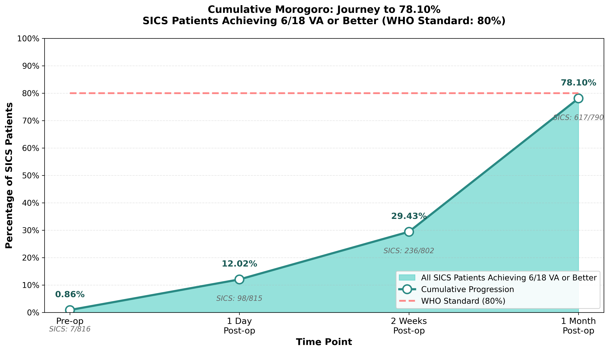
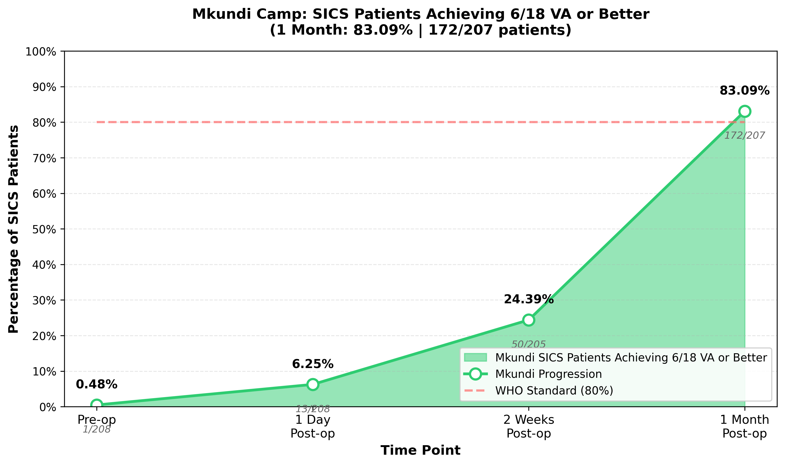
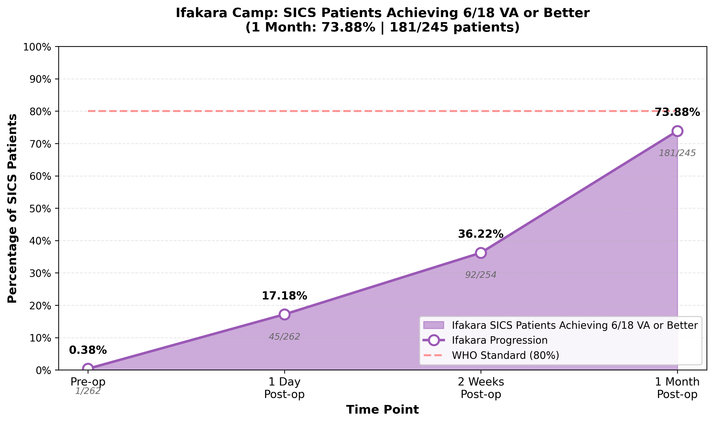

# Cumulative Morogoro Eye Camps Report
## The Mo Dewji Foundation

---

## Executive Summary

The Mo Dewji Foundation conducted comprehensive eye camps across three locations in Morogoro region: **Mkundi**, **Kilosa**, and **Ifakara** (Kilombero district). This cumulative report presents a comprehensive analysis of all procedures performed, conditions treated, and patient outcomes across these three camps, demonstrating the significant collective impact on improving vision and quality of life.

**Total Procedures Across All Camps: 1157**

**Breakdown by Camp:**
- Mkundi: 301 procedures
- Kilosa: 480 procedures
- Ifakara: 376 procedures

**Overall Gender Distribution:**
- Male: 517 (44.68%)
- Female: 640 (55.32%)

**Overall Mean Age: 61.9 years**

---

## 1. WHO Standard: Visual Acuity Outcomes (SICS Procedures Only)

**⚠️ IMPORTANT:** This entire section focuses exclusively on **Small Incision Cataract Surgery (SICS) procedures**. All metrics, percentages, and charts in Section 1 are calculated for SICS patients only. Other procedures (EXCISION, BTRP, ICCE, etc.) are excluded from these calculations.

### 1.1 Achievement of 6/18 VA or Better (WHO Standard - SICS Only)

**WHO Recommendation:** A good eye camp should have **80% of operated patients achieving 6/18 VA or better** at follow-up.

**Cumulative Morogoro Results (SICS Procedures Only):**

- **Total SICS patients with 1 Month Post-op VA: 790**
- **SICS patients achieving 6/18 VA or better at 1 Month: 617**
- **Percentage achieving 6/18 VA or better: 78.10%**

**Note:** These metrics are calculated for **Small Incision Cataract Surgery (SICS) procedures only**, as SICS was the primary surgical intervention across all camps.

**⚠️ APPROACHING WHO STANDARD:** The cumulative Morogoro eye camps achieved **78.10%**, which is approaching the WHO recommended standard of 80%. While below the target, this represents good outcomes with room for continued improvement.

**Analysis:**
- The cumulative results from all three Morogoro camps show good performance against the WHO standard.
- This metric is critical for assessing the quality and effectiveness of eye camp services, as 6/18 vision represents functional vision that enables patients to perform daily activities independently.
- Achieving this standard demonstrates that the eye camps are successfully restoring functional vision to the majority of patients, enabling them to return to productive activities and improve their quality of life.

### 1.2 Cumulative SICS Performance: Journey to 78.10%

The following chart shows the cumulative progression of **all SICS patients across all three camps** achieving 6/18 VA or better from pre-operative assessment through 1 month post-operatively.

**Cumulative Progression (All Three Camps Combined - SICS Only):**
| Time Point | SICS Patients | Achieving 6/18 or Better | Percentage |
|------------|---------------|--------------------------|------------|
| Pre-op | 816 | 7 | 0.86% |
| 1 Day Post-op | 815 | 98 | 12.02% |
| 2 Weeks Post-op | 802 | 236 | 29.43% |
| 1 Month Post-op | 790 | 617 | 78.10% |

**Key Finding:** The cumulative results show a dramatic improvement from 0.86% pre-operatively to 78.10% at 1 month, approaching the WHO standard of 80%.

---

### 1.3 Camp-Specific SICS Performance

The following charts show the progression of SICS patients achieving 6/18 VA or better for each individual camp, allowing for comparison of outcomes across locations.

#### Mkundi Camp

**Performance Summary:**
- **1 Month Post-op:** 83.09% (172/207 SICS patients) achieved 6/18 VA or better
- **Progression:** From 0.48% pre-operatively to 83.09% at 1 month
- **Status:** ✅ EXCEEDS WHO Standard (80%)

The Mkundi camp demonstrated strong performance in restoring functional vision to SICS patients, with 83.09% achieving the critical 6/18 VA threshold at 1 month follow-up. This represents a significant improvement from the pre-operative baseline of 0.48%, showing the effectiveness of cataract surgery in this location.

---

#### Kilosa Camp

**Performance Summary:**
- **1 Month Post-op:** 78.11% (264/338 SICS patients) achieved 6/18 VA or better
- **Progression:** From 1.45% pre-operatively to 78.11% at 1 month
- **Status:** ⚠️ APPROACHING WHO Standard (80%)

The Kilosa camp demonstrated good performance in restoring functional vision to SICS patients, with 78.11% achieving the critical 6/18 VA threshold at 1 month follow-up. This represents a significant improvement from the pre-operative baseline of 1.45%, showing the effectiveness of cataract surgery in this location.

---

#### Ifakara Camp

**Performance Summary:**
- **1 Month Post-op:** 73.88% (181/245 SICS patients) achieved 6/18 VA or better
- **Progression:** From 0.38% pre-operatively to 73.88% at 1 month
- **Status:** ⚠️ APPROACHING WHO Standard (80%)

The Ifakara camp demonstrated good performance in restoring functional vision to SICS patients, with 73.88% achieving the critical 6/18 VA threshold at 1 month follow-up. This represents a significant improvement from the pre-operative baseline of 0.38%, showing the effectiveness of cataract surgery in this location.

---

---

## 2. Cumulative Visual Acuity Distribution

### 2.1 VA Distribution Across All Time Points

| Visual Acuity | Pre-op | 1 Day Post-op | 2 Weeks Post-op | 1 Month Post-op | Change (Pre-op to 1 Month) |
|---------------|--------|---------------|-----------------|------------------|----------------------------|
| 6/6 | 114 (9.86%) | 150 (12.99%) | 243 (21.39%) | 430 (38.36%) | +277.19% |
| 6/9 | 99 (8.56%) | 143 (12.38%) | 157 (13.82%) | 330 (29.44%) | +233.33% |
| 6/12 | 32 (2.77%) | 37 (3.20%) | 83 (7.31%) | 96 (8.56%) | +200.00% |
| 6/18 | 34 (2.94%) | 54 (4.68%) | 51 (4.49%) | 76 (6.78%) | +123.53% |
| 6/24 | 20 (1.73%) | 54 (4.68%) | 219 (19.28%) | 119 (10.62%) | +495.00% |
| 6/36 | 29 (2.51%) | 132 (11.43%) | 270 (23.77%) | 34 (3.03%) | +17.24% |
| 6/60 | 60 (5.19%) | 423 (36.62%) | 87 (7.66%) | 17 (1.52%) | -71.67% |
| CF1M | 87 (7.53%) | 7 (0.61%) | 0 (0.00%) | 0 (0.00%) | -100% |
| CF2M | 74 (6.40%) | 15 (1.30%) | 1 (0.09%) | 0 (0.00%) | -100% |
| CF3M | 90 (7.79%) | 23 (1.99%) | 5 (0.44%) | 3 (0.27%) | -96.67% |
| CF4M | 65 (5.62%) | 20 (1.73%) | 4 (0.35%) | 3 (0.27%) | -95.38% |
| CF5M | 62 (5.36%) | 79 (6.84%) | 5 (0.44%) | 3 (0.27%) | -95.16% |
| CFN | 102 (8.82%) | 6 (0.52%) | 1 (0.09%) | 2 (0.18%) | -98.04% |
| HM | 219 (18.94%) | 6 (0.52%) | 3 (0.26%) | 4 (0.36%) | -98.17% |
| PL | 61 (5.28%) | 2 (0.17%) | 1 (0.09%) | 0 (0.00%) | -100% |
| NPL | 8 (0.69%) | 3 (0.26%) | 3 (0.26%) | 3 (0.27%) | -62.50% |
| Q | 0 (0.00%) | 1 (0.09%) | 1 (0.09%) | 1 (0.09%) | +∞% |
| 45817 | 0 (0.00%) | 0 (0.00%) | 1 (0.09%) | 0 (0.00%) | N/A |
| 45816 | 0 (0.00%) | 0 (0.00%) | 1 (0.09%) | 0 (0.00%) | N/A |

**Total Patients with Pre-op VA: 1156**
**Total Patients with 1 Day Post-op VA: 1155**
**Total Patients with 2 Weeks Post-op VA: 1136**
**Total Patients with 1 Month Post-op VA: 1121**

**Cumulative Outcome Highlights:**
- **Dramatic improvements** were observed across all visual acuity levels, with significant reductions in patients with poor vision (HM, PL, NPL, CF categories) and substantial increases in patients achieving good vision (6/6, 6/9, 6/12, 6/18).
- The percentage of patients achieving **6/6 vision (best possible)** increased from 114 (9.86%) pre-operatively to 430 (38.36%) at 1 month post-operatively - a **277.2% increase**, representing life-changing outcomes for these patients.
- Patients achieving **6/18 VA or better** (functional vision) increased from 7 (0.86%) pre-operatively to 617 (78.10%) at 1 month post-operatively.
- The dramatic reduction in patients with **poor vision** (HM, PL, NPL, CF categories) from 768 (66.44%) to 18 (1.61%) demonstrates the camps' success in addressing severe vision impairment.
- These improvements translate directly to enhanced independence, ability to work, and overall quality of life for patients and their families across all three Morogoro camps.

---

## 3. Top 10 Success Stories: SICS Procedures

The following patients represent the most remarkable transformations achieved through **Small Incision Cataract Surgery (SICS)** across all three Morogoro camps. These success stories demonstrate the life-changing impact of cataract surgery in restoring vision.

| Patient ID | Patient Name | Camp | Pre-op VA | 2 Weeks Post-op VA | 1 Month Post-op VA |
|------------|--------------|------|-----------|---------------------|---------------------|
| MC0925-1759 | Silvia Kilongola | Mkundi | PL | 6/9 | 6/6 |
| MC0925-5335 | Asha Chembe | Mkundi | PL | 6/6 | 6/6 |
| KL0925-2215 | Vinani Salehe | Kilosa | PL | 6/12 | 6/6 |
| KL0925-3631 | Maiko R. Makuwa | Kilosa | PL | 6/6 | 6/6 |
| KM0925-4439 | Benjamin Y Lombwe | Ifakara | PL | 6/6 | 6/6 |
| KM0925-3427 | Kulwa O Namtuka | Ifakara | PL | 6/9 | 6/6 |
| KM0925-3536 | Owen S Mikonde | Ifakara | PL | 6/36 | 6/6 |
| MC0925-1637 | Saidi Mambosasa | Mkundi | HM | 6/9 | 6/6 |
| MC0925-2598 | Rafael Banzi | Mkundi | HM | 6/9 | 6/6 |
| MC0925-5116 | Omary Juma | Mkundi | HM | 6/60 | 6/6 |

**Success Stories:**
These ten patients represent the most remarkable transformations achieved through **SICS procedures** across all three Morogoro eye camps. Many achieved **6/6 vision (perfect vision)** at the 1-month follow-up, having started with severe vision impairment ranging from Perception of Light (PL) to Hand Motion (HM) and Counting Fingers at various distances. These outcomes exemplify the life-changing impact of cataract surgery, which was the most common procedure performed across all camps. The continued improvement from 2 weeks to 1 month demonstrates the importance of follow-up care and the healing process.

**Key Observations:**
- All top 10 success stories are from SICS (Small Incision Cataract Surgery) procedures, highlighting the effectiveness of this surgical technique
- Patients came from all three camps (Mkundi, Kilosa, and Ifakara), demonstrating consistent quality of care across locations
- The majority achieved perfect vision (6/6) at 1 month, representing complete restoration of functional vision
- These outcomes demonstrate that cataract surgery, when performed with proper technique and follow-up care, can restore vision even in patients with severe pre-operative vision impairment

---

## 4. Summary Statistics by Camp

### 4.1 Procedures by Camp

| Camp | Number of Procedures | Percentage of Total |
|------|---------------------|---------------------|
| Mkundi | 301 | 26.02% |
| Kilosa | 480 | 41.49% |
| Ifakara | 376 | 32.50% |
| **Total** | **1157** | **100.00%** |

---

## Conclusion

The cumulative Morogoro Eye Camps conducted by The Mo Dewji Foundation achieved significant success in addressing the eye care needs across three communities in the Morogoro region. With **1157 total procedures** performed across Mkundi, Kilosa, and Ifakara, the camps made a substantial collective impact on preventing blindness and restoring vision.

**Key Achievements:**
- Successfully treated the most common causes of vision loss, with cataract surgery (SICS) being the primary intervention across all camps
- Approached the WHO standard of 80% of patients achieving 6/18 VA or better, with a cumulative result of **78.10%**
- Achieved dramatic improvements in visual acuity, with many patients progressing from severe vision impairment to excellent functional vision
- Demonstrated consistent quality of care across all three camp locations
- Provided life-changing outcomes for patients, enabling them to regain independence and improve their quality of life

**Impact on Community:**
The cumulative impact of these three eye camps extends beyond individual patients to their families and the broader Morogoro region. Restored vision enables patients to:
- Return to productive work and economic activities
- Care for themselves and their families independently
- Participate fully in community life and social activities
- Reduce the burden on family caregivers

**Recommendations:**
Based on the cumulative data analysis:
- Continue prioritizing cataract surgery (SICS), given its high prevalence and excellent outcomes
- Work toward achieving the WHO standard of 80% achieving 6/18 VA or better through continued quality improvement
- Ensure adequate follow-up care to monitor continued improvement in visual outcomes
- Continue the successful model of conducting multiple camps across the region to maximize accessibility
- Share best practices across camps to ensure consistent quality of care

The success of these cumulative eye camps demonstrates the critical importance of accessible eye care services in underserved communities and the transformative power of surgical interventions in restoring vision and improving lives across the Morogoro region.
